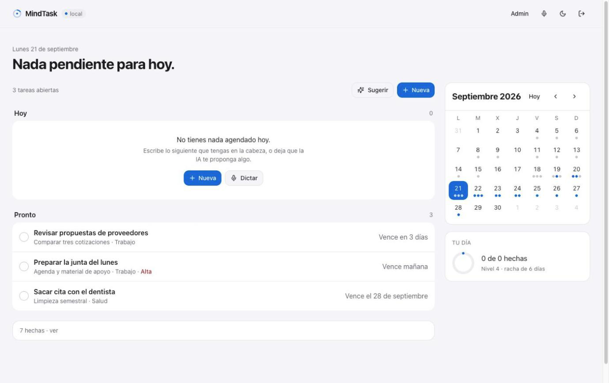
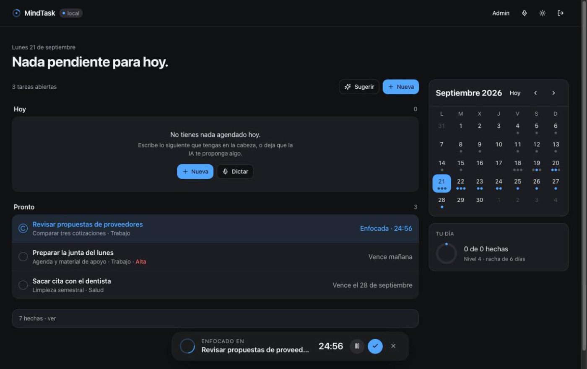

# MindTask

A personal task manager that runs on your own machine: your database, your model,
your data. No landing page, no sign-up funnel — it opens straight into the app.

The whole stack is local by default: the database runs inside the app, and the
language model and the speech-to-text run on localhost, so it keeps working on a
plane and nothing you write or say leaves the computer unless you point it at a
cloud provider yourself.




---

## What it does

**One screen answers one question: what do I do now.** The day opens with its
date and its count, and the sections stack below it — what slipped past, today,
soon, no date, and the finished ones folded at the end. Nothing hides behind a
filter, so an empty day still shows the week ahead.

**Focus belongs to a task, not to a timer.** Pick a task and a bar slides up from
the bottom with its name and 25 minutes running, the way the music player works
on iOS. The row it belongs to shows the same clock. Close the bar and it's gone —
there is no timer widget sitting there when nothing is running.

**Writing a task is writing a sentence.** Type *"llamar al dentista el viernes"*
and the app reads the date, the priority and the category out of it, and shows
what it understood as chips before saving. The same interpreter runs behind
dictation, so both paths behave identically. Speak and the text appears as you
talk, corrected as the sentence goes on.

**The calendar and the list live together.** The month sits beside the list with a
dot per task; picking a day filters the list to that day.

**Suggestions come from a model you chose.** Ask for three and they arrive from
whatever provider is configured — or the feature politely says it isn't
configured, and the rest of the app carries on.

---

## Run it

Two commands. No Docker, no database server, no account:

```bash
npm install
npm run dev
```

The database is [PGlite](https://pglite.dev) — the same Postgres, compiled to
WebAssembly and running inside the app, stored on your machine. Real SQL, real
types, no server to start. There is no login either: it's your computer, so what
keeps your tasks private is the operating system, not a row-level policy.

For the AI features, point the app at a provider (all optional — without one the
app works and only the AI parts stand down):

```bash
cp .env.example .env
ollama pull llama3.2
launchctl setenv OLLAMA_ORIGINS "*"   # let the app's origin reach Ollama, then restart it
```

> npm is the package manager here. The repo used to carry a stale `bun.lockb`
> from its Lovable scaffold alongside `package-lock.json`; two lockfiles for one
> project is how installs start drifting between machines.

### Voice dictation, also local

Ollama generates text but does not transcribe audio, so dictation needs its own
engine. whisper.cpp covers it without leaving the machine:

```bash
brew install whisper-cpp
mkdir -p ~/.whisper-models && curl -L -o ~/.whisper-models/ggml-base.bin \
  https://huggingface.co/ggerganov/whisper.cpp/resolve/main/ggml-base.bin
whisper-server -m ~/.whisper-models/ggml-base.bin --port 8178 -l es
```

Then set `VITE_AI_STT_BASE_URL=http://localhost:8178` and
`VITE_AI_STT_FORMAT=whisper-cpp`. `ggml-base` (141 MB) is enough to try it;
`ggml-small` (~466 MB) transcribes noticeably better in Spanish.

---

## Bring your own model

Nothing in the app is tied to one AI vendor. `src/lib/ia.ts` reads the provider from the environment and speaks two wire formats —
OpenAI-compatible and Anthropic — so the same code runs against any of these:

| `VITE_AI_PROVIDER` | What you need | Notes |
|---|---|---|
| `ollama` | Ollama running locally | No API key, nothing leaves the machine |
| `openai` | `VITE_AI_API_KEY` | Also covers voice transcription (`whisper-1`) |
| `anthropic` | `VITE_AI_API_KEY` | Text only — Anthropic does not transcribe audio |
| `custom` | `VITE_AI_BASE_URL` + model | Any OpenAI-compatible server (vLLM, LM Studio, a gateway) |

Transcription can point somewhere else than text generation —
`VITE_AI_STT_BASE_URL`, `VITE_AI_STT_API_KEY` and `VITE_AI_STT_FORMAT` — which is
how a local Whisper pairs with a hosted chat model, or the other way round.

Because the app talks to the provider directly, an API key you put in `.env`
ships in the bundle. That's fine for a local key like Ollama's (there isn't one)
and fine for your own machine; don't publish a build carrying someone's paid key.

If no provider is configured the AI endpoints answer `503` with a clear message
and the rest of the app keeps working. Nothing crashes because a key is missing.

---

## How it holds up

The AI layer is the part most likely to fail in the real world, so it is the part
with the most guardrails:

- **A 30-second ceiling per call**, retries and waits included, after which the
  caller gets a `504` instead of a spinner that never ends.
- **Two retries with growing waits**, and only when the provider answers `429` or
  `5xx`. A `400` is never retried, because it will fail again.
- **Every call is recorded** in `ai_usage` with provider, model, tokens,
  milliseconds, status and attempts. `resumenUsoIA()` turns that into medians and p95.

Measured on this machine:

| Model | Machine | Successful | Median | p95 | Input tokens | Output tokens | Cost |
|---|---|---|---|---|---|---|---|
| llama3.2 (Ollama) | Apple M5 Pro, 24 GB | 20/20 | 0.91 s | 1.23 s | 163 | 102 | — (local) |

---

## Data model

Four tables in the embedded Postgres: `tasks`, `pomodoro_sessions`, `user_stats`
and `ai_usage`. No users table and no roles — a personal app with one person in
it doesn't need to model who is allowed to see what.

`src/lib/datos.ts` is the whole data layer, plain SQL. `src/lib/ia.ts` is the
whole AI layer, and both run in the app. There is no backend to deploy, and no
Edge Functions: the previous version routed AI calls through Supabase so the key
would stay off the client, which stops making sense once the client *is* the
machine that owns the key.

---

## Tests

```bash
npm test                  # 57 tests: provider selection, wire formats, retries, timeouts, parsing, dictation
npm run medir-interprete  # how well the interpreter reads a sentence, over 25 real phrases
```

The evaluation set lives in `evals/frases.json` and says what *should* be
understood, not what the code does today. Its first run scored 84% and pointed at
two real bugs — "crear tarea comprar café" landed in the Estudio category because
"tarea" counted as a school word, and removing a word from the middle of a
sentence left debris behind. Both fixed, it now reads all four fields correctly
on all 25 phrases.

GitHub Actions runs the tests and the evaluation on every push, with a floor of
90%: a case that gets worse shows up there instead of in the next demo.

---

## Design

The interface follows Apple's Human Interface Guidelines: grouped lists with
hairline separators instead of a card per row, a single accent for anything
actionable, and red quarantined for overdue work — if warm colour shows up,
something is late.

Both themes are designed, not inverted, and every pair that carries text was
measured: system blue reaches 5.34:1 against white in light mode and 6.63:1
against the card in dark mode; the overdue red reaches 6.28:1 on its own pill.
The app follows the system theme until you pick one.

`docs/auditoria-visual.md` holds the audit the redesign came from — eight
findings, each with what was wrong, why it mattered citing the guideline, and how
it was fixed.

---

## What's missing

- No desktop packaging yet. It runs in a browser tab, which contradicts the rest
  of the idea; Tauri is the next step.
- No evaluation set for transcription accuracy, so the quality claims about
  Whisper models are anecdotal. The interpreter is measured; Whisper is not.
- No recurring tasks and no search — both start to matter past a hundred tasks.
- The database lives in the browser's storage. Exporting works (`exportar()` in
  the data layer) but there is no button for it yet.

---

## Credits

The first scaffold came out of Lovable; everything since — the swappable AI layer,
the local stack, dictation, the redesign, the tests — was built on top of it.
